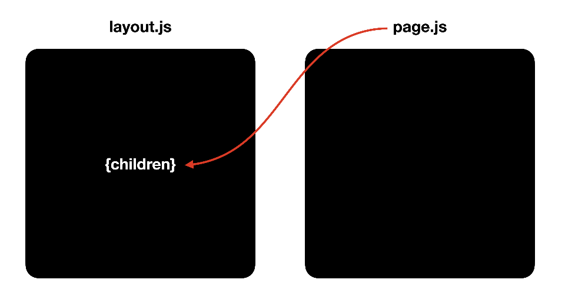
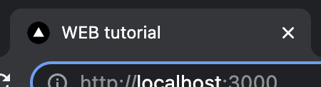
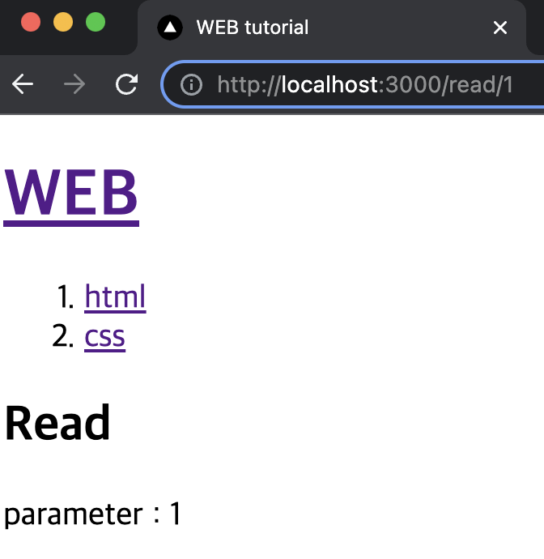
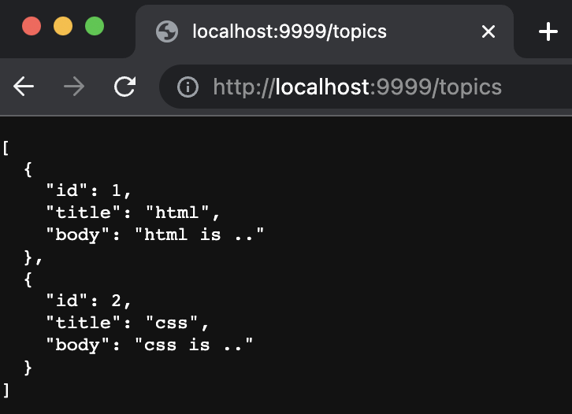
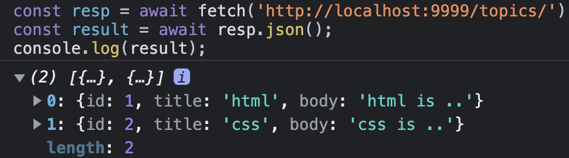
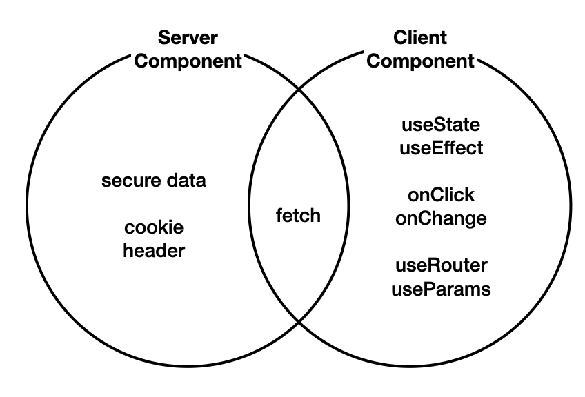
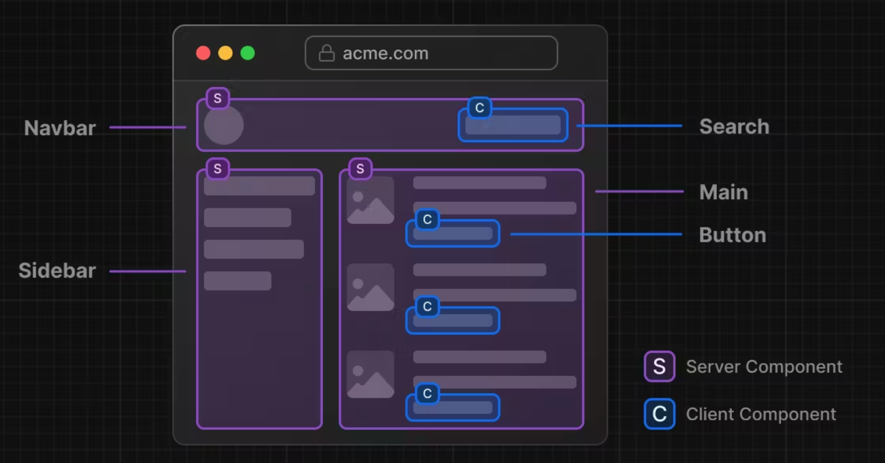

## layout.js와 page.js의 관계
`layout.js`의 `children` prop은 `page.js`의 리턴값이다.



```jsx
//layout.js
export default function RootLayout({ children }) {
  return (
    <html>
      <body>{children}</body>
    </html>
  )
}
```

<br/>

## 빌드와 배포
빌드는 애플리케이션을 최적화하고 실제 서버에서 호스팅하기 위한 효율적인 배포 버전을 생성하는 필수 단계이다.<br/>
(용량 최소화, 불필요한 메세지를 콘솔에 출력하지 않는 등)

### build
`.next` 폴더 하위에 배포 가능한 버전의 애플리케이션을 생성한다
```bash
npm run build
```

### start
생성된 배포 버전을 바탕으로 서비스를 시작한다
```bash
npm run start
```

<br/>

## metadata
`layout.js` 혹은 `page.js`에서 `metadata`를 `export`하면 html의 head안에 내용을 생성할 수 있다

```jsx
// app/layout.js
export const metadata = {
  title: 'WEB tutorial',
  description: 'Generated by egoing',
}
```


<br/>

## Routing
사용자가 접속한 URL의 path에 따라서 콘텐츠를 응답해주는 작업을 `라우팅`이라고 한다.<br/>
Next.js는 간단하고 직관적인 라우팅을 제공하며, 프로젝트의 복잡성을 효과적으로 관리할 수 있도록 도와준다.

### 0. URL 용어 정리
`/dashboard/analytics/` 부분을 `path`, `dashboard`와 `analytics` 각각을 `segment`라고 한다


<br/>

### 1. 페이지 만드는 방법
`create/pages.js` 파일을 생성하면 `/create` 페이지가 정상 출력된다
```jsx
// app/create/page.js
export default function Create(){
  return <>
    Create!!
  </>
}
```
#### 알 수 있는 것
- `app` 하위의 폴더는 세그먼트를 의미한다
- `app/create/page.js` 파일의 반환 값이 상위 컴포넌트의 `layout.js`의 `children` prop으로 전달된다.

<br/>

### 2. Next.js의 라우팅 로직
Next.js는 레이아웃의 중첩을 허용한다. 때문에 URL 경로의 세그먼트에 따라 콘텐츠를 찾고, 해당 콘텐츠가 위치한 폴더의 `layout.js`를 시작으로 상위 폴더를 탐색하면서 `layout.js`로 감싸준다.

#### 중첩된 하위 레이아웃 만들기
`app/create/page.js`를 감싸는 `app/create/layout.js` 하위 레이아웃 파일을 생성한다.<br/>
이처럼 하위 레이아웃이 있다면, `app/create/layout.js`로 `app/create/page.js`를 포장한 후에 `app/layout.js`로 포장한다.

```jsx
// props : app/create/page.js 리턴값
export default function Layout(props){
  return (
    <form>
      <h2>Create</h2>
      {props.children}
    </form>
  )
}
```

<br/>

### 3. 동적 라우팅(dynamic routing)
`read/1`, `read/2` 의 1,2와 같이 가변적으로 변경되는 경로를 처리해보자.

### 페이지 생성
`/app/read/[id]/page.js` 다음과 같이 파일을 생성하면 `/read/1` 페이지가 정상 출력된다

### 라우팅 로직
`/read/1`로 접속하면 1의 자리에 해당하는 폴더인 [id]의 이름을 기준으로 `props`를 만들어서 주입해준다. 이 값을 사용해서 여러 작업을 처리할 수 있다.
```jsx
export default function Read(props){
  return <>
    <h2>Read</h2>
    parameter : {props.params.id}
  </>
}
```


<br/>

## SPA(Single Page Application)
하나의 페이지에서 모든 작업을 처리하는 앱을 의미한다<br/> 
서버로부터 가져올 데이터가 있다면 ajax와 같은 방법을 통해서 동적으로 로딩한다

### Link
```jsx
<Link href='/'>Home</Link>
```
`Link`는 Next.js에서 SPA를 매우 쉽게 구현하도록 도와주는 도구이다

- 링크를 클릭하면 페이지 전체 리로딩이 일어나지 않고 필요한 콘텐츠만 리로딩
- 이미 방문한 페이지는 캐슁을 해서 다시 다운로드 받지 않음
- 미리 페이지를 다운로드 받고, 실제 요청이 있을 때 클라이언트 측에서 즉시 응답함(클릭 전)

<br/>

## 정적인 자원 사용하기(public)
이미지, robots.txt, favicon.ico와 같은 파일을 static asset라고 한다<br/>
Next.js에서 정적 자원을 로딩하는 방법을 알아보자


### 이미지 로딩 해보기
#### 1. public 폴더에 이미지 추가


#### 2. 이미지 사용
슬래시(`/`)는 `public` 폴더 하위를 의미한다
```html

```

<br/>

## 전역 스타일 지정
전역적인 디자인을 적용하고 싶다면 app/global.css를 수정하면 된다

<br/>

## Json-server로 Backend 구축하기
Json-server를 이용해서 간단하게 백엔드를 구축해보자

    Nextjs은 백엔드까지 동시에 제공하는 full stack framework이다.
    Route Handlers를 사용하면 별도의 백엔드를 구축하지 않고 Nextjs API 서버까지 구축할 수 있다.

### 1. `json-server` 실행
```bash
npx json-server --port 9999 --watch db.json
```

### 2. `db.json` 파일 생성 확인 및 수정
```json
{
  "topics": [
    {
      "id": 1,
      "title": "html",
      "body": "html is .."
    },
    {
      "id": 2,
      "title": "css",
      "body": "css is .."
    }
  ],
  "posts": [
    {
      "id": 1,
      "title": "json-server",
      "author": "typicode"
    }
  ],
}
```

### 3. 지정한 포트로 접속하여 확인

  
### 4. 통신해보기
```javascript
const resp = await fetch('http://localhost:9999/topics/');
const result = await resp.json();
console.log(result);
```


<br/>

## 서버 컴포넌트 vs 클라이언트 컴포넌트
Nextjs의 컴포넌트는 크게 `server component`와 `client component`로 구분된다<br/>
특별한 처리를 하지 않으면 디폴트 컴포넌트는 `server component` 이다<br/>



#### 서버 컴포넌트
    - 서버에서 렌더링되는 컴포넌트
    - 서버에서 렌더링되기 때문에 빠르게 렌더링되고, SEO에 유리하다
    - 클라이언트 컴포넌트보다 제약이 많다
    - 클라이언트 컴포넌트보다 더 빠르게 렌더링되지만, 덜 유연하다
#### 클라이언트 컴포넌트
    - 클라이언트에서 렌더링되는 컴포넌트
    - 서버 컴포넌트보다 더 유연하지만, 덜 빠르게 렌더링된다

<br/>

### 적절한 사용사례
다음은 서버/클라이언트 컴포넌트의 적절한 사용 사례를 보여준다



#### 서버 컴포넌트
    - 사용자와 상호작용하지 않는 경우(단순 노출)
    - 백엔드에 엑세스하면서 보안적으로 위험한 정보를 주고 받는 경우

#### 클라이언트 컴포넌트
    - 서버 컴포넌트로 해결되지 않는 경우
    - 사용자와 상호작용하는 경우
    - `useEffect`, `useState`, `onClick`, `onChange와` 같은 API를 사용해야 하는 경우
    - `useRouter`, `useParams와` 같은 Nextjs의 client component API를 사용하는 경우

<br/>

## SSR(Server Side Rendering)
서버 컴포넌트는 모든 작업을 서버 쪽에서 처리하고, 그 결과인 html 코드만 클라이언트로 전송한다.<br/>
이것을 서버쪽에서 랜더링을 한다고하여 SSR(server side rendering)이라고 한다.

### SSR의 장점
- `간결한 코드`: 클라이언트 컴포넌트 전용 훅을 사용하지 않아 코드가 더 간결하고 이해하기 쉬워짐. 이로 인해 코드 유지 관리가 쉬워지고 버그 발생 확률이 줄어듦.
- `빠른 데이터 엑세스`: 서버 컴포넌트는 데이터베이스와 가까운 위치에서 작동하기때문에 필요한 데이터에 빠르게 접근 가능.
- `보안`: 클라이언트에 민감한 정보(예: 데이터베이스 비밀번호)를 전송하지 않고 안전하게 작업을 처리하면서 클라이언트의 보안 유지.
- `향상된 성능`: 클라이언트로 JavaScript 코드를 전송하지 않는다. 전송되는 데이터의 양을 줄이고, 클라이언트의 부하를 감소시켜 성능을 향상시키는 데 도움이 줌.

### SSR 적용해보기
서버쪽의 글목록 데이터를 가져와서(fetch) 이를 UI에 반영해보자
```jsx
// src/app/layout.js

import Link from 'next/link';
import './globals.css'

export const metadata = {
  title: 'WEB tutorial',
  description: 'Generated by egoing',
}

// 서버에서 데이터를 가져와서 렌더링하는 경우(fetch) `useEffect`를 사용하지 않고 `await`를 사용한다
export default async function RootLayout({ children }) {

  // 글 목록 가져오기
  const resp = await fetch('http://localhost:9999/topics/'); 
  const topics = await resp.json();

  // 출력 결과가 개발자 도구의 콘솔에서는 나타나지 않고, 터미널에서만 출력 된다
  console.log('page/layout.js/topics', topics);

  return (
    <html>
      <body>
        <h1><Link href="/">WEB</Link></h1>
        <ol>
          {topics.map(topic=>{
            return <li key={topic.id}><Link href={`/read/${topic.id}`}>{topic.title}</Link></li>
          })}
        </ol>
        {children}
        <ul>
          <li><Link href="/create">create</Link></li>
          <li><Link href="/update/id">update</Link></li>
          <li><button>delete</button></li>
        </ul>
      </body>
    </html>
  )
}
```

<br/>

## Client Component 구현
`onSubmit`과 같이 사용자와 상호작용하는 코드는 서버 쪽에서 실행할 수 없기 때문에, 클라이언트 쪽으로 전송되어서 실행되야 한다. 클라이언트 컴포넌트를 만드는 방법을 알아보자.

### 클라이언트 컴포넌트로 전환하기
아래 코드를 사용하면 client component로 전환된다.<br/>
클라이언트 컴포넌트가 되면 `useEffect`, `useState`, `onSubmit`, `useRouter` 과 같은 코드를 사용할 수 있다.
```jsx
'use client'
```

### 라우터
#### 라우터 객체 생성
`useRouter`를 사용하면 라우터 객체를 생성할 수 있다<br/>
```jsx
const router = useRouter();
```

#### 사용
`router.push`를 사용하면 페이지 리로드 없이 사용자의 화면을 해당 페이지로 이동한다
```jsx
router.push(`/read/${topic.id}`);
```
`router.refresh`를 사용하면 서버 컴포넌트를 서버 쪽에서 다시 랜더링해서 새로 고침할 수 있다
```jsx
router.refresh();
```

#### cache 업데이트
`router.refresh`를 했음에도 갱신되지 않는다면, 서버쪽에서 fetch를 사용하면 응답 결과를 저장하기 때문이다.<br/>
fetch 단계에서 캐시를 사용하지 않기 위해 `{cache:'no-cache'}` 를 추가한다. 랜더링 될 때매다 캐쉬를 사용하지 않고 신선한 데이터를 가져온다.(매번 MISS)

    MISS: 캐쉬가 없기 때문에 서버에 실제로 접속해서 데이터를 가져왔다는 뜻
    HIT: 캐쉬를 사용했다는 뜻
  
```jsx
const resp = await fetch('http://localhost:9999/topics/', {cache:'no-cache'}); 
```

</br>

## server component에서 client component 사용하기
### 1. server component에서 client component의 기능이 필요한 부분만 별도의 컴포넌트로 분리
```jsx
"use client";
import Link from 'next/link';
import { useParams } from 'next/navigation';

export function Control() {
  const params = useParams(); // only client component
  console.log(params);
  const id = params.id;

  return (
    <ul>
      <li><Link href='/create'>Create</Link></li>
      { id ? (
        <>
          <li><Link href={`/update/${id}`}>Update</Link></li>
          <li><input type='button' value='Delete' /></li>
        </>
      ): null }
    </ul>
  );
}
```

### 2. server component에서 import 하여 사용
```jsx
// ...
import { Control } from './Control';

export default async function RootLayout({ children }) {
  return (
    <html>
      <body>
        // ...
        <Control />
      </body>
    </html>
  )
}
```
