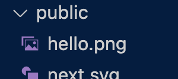

## layout.js와 page.js의 관계
`layout.js`의 `children` prop은 `page.js`의 리턴값이다.


```jsx
//layout.js
export default function RootLayout({ children }) {
  return (
    <html>
      <body>{children}</body>
    </html>
  )
}
```

<br/>

## 빌드와 배포
빌드는 애플리케이션을 최적화하고 실제 서버에서 호스팅하기 위한 효율적인 배포 버전을 생성하는 필수 단계이다.<br/>
(용량 최소화, 불필요한 메세지를 콘솔에 출력하지 않는 등)

### build
`.next` 폴더 하위에 배포 가능한 버전의 애플리케이션을 생성한다
```bash
npm run build
```

### start
생성된 배포 버전을 바탕으로 서비스를 시작한다
```bash
npm run start
```

<br/>

## metadata
`layout.js` 혹은 `page.js`에서 `metadata`를 `export`하면 html의 head안에 내용을 생성할 수 있다

```jsx
// app/layout.js
export const metadata = {
  title: 'WEB tutorial',
  description: 'Generated by egoing',
}
```


<br/>

## Routing
사용자가 접속한 URL의 path에 따라서 콘텐츠를 응답해주는 작업을 `라우팅`이라고 한다.<br/>
Next.js는 간단하고 직관적인 라우팅을 제공하며, 프로젝트의 복잡성을 효과적으로 관리할 수 있도록 도와준다.

### 0. URL 용어 정리
`/dashboard/analytics/` 부분을 `path`, `dashboard`와 `analytics` 각각을 `segment`라고 한다


<br/>

### 1. 페이지 만드는 방법
`create/pages.js` 파일을 생성하면 `/create` 페이지가 정상 출력된다
```jsx
// app/create/page.js
export default function Create(){
  return <>
    Create!!
  </>
}
```
#### 알 수 있는 것
- `app` 하위의 폴더는 세그먼트를 의미한다
- `app/create/page.js` 파일의 반환 값이 상위 컴포넌트의 `layout.js`의 `children` prop으로 전달된다.

<br/>

### 2. Next.js의 라우팅 로직
Next.js는 레이아웃의 중첩을 허용한다. 때문에 URL 경로의 세그먼트에 따라 콘텐츠를 찾고, 해당 콘텐츠가 위치한 폴더의 `layout.js`를 시작으로 상위 폴더를 탐색하면서 `layout.js`로 감싸준다.

#### 중첩된 하위 레이아웃 만들기
`app/create/page.js`를 감싸는 `app/create/layout.js` 하위 레이아웃 파일을 생성한다.<br/>
이처럼 하위 레이아웃이 있다면, `app/create/layout.js`로 `app/create/page.js`를 포장한 후에 `app/layout.js`로 포장한다.

```jsx
// props : app/create/page.js 리턴값
export default function Layout(props){
  return (
    <form>
      <h2>Create</h2>
      {props.children}
    </form>
  )
}
```

<br/>

### 3. 동적 라우팅(dynamic routing)
`read/1`, `read/2` 의 1,2와 같이 가변적으로 변경되는 경로를 처리해보자.

### 페이지 생성
`/app/read/[id]/page.js` 다음과 같이 파일을 생성하면 `/read/1` 페이지가 정상 출력된다

### 라우팅 로직
`/read/1`로 접속하면 1의 자리에 해당하는 폴더인 [id]의 이름을 기준으로 `props`를 만들어서 주입해준다. 이 값을 사용해서 여러 작업을 처리할 수 있다.
```jsx
export default function Read(props){
  return <>
    <h2>Read</h2>
    parameter : {props.params.id}
  </>
}
```


<br/>

## SPA(Single Page Application)
하나의 페이지에서 모든 작업을 처리하는 앱을 의미한다<br/> 
서버로부터 가져올 데이터가 있다면 ajax와 같은 방법을 통해서 동적으로 로딩한다

### Link
```jsx
<Link href='/'>Home</Link>
```
`Link`는 Next.js에서 SPA를 매우 쉽게 구현하도록 도와주는 도구이다

- 링크를 클릭하면 페이지 전체 리로딩이 일어나지 않고 필요한 콘텐츠만 리로딩
- 이미 방문한 페이지는 캐슁을 해서 다시 다운로드 받지 않음
- 미리 페이지를 다운로드 받고, 실제 요청이 있을 때 클라이언트 측에서 즉시 응답함(클릭 전)

<br/>

## 정적인 자원 사용하기(public)
이미지, robots.txt, favicon.ico와 같은 파일을 static asset라고 한다<br/>
Next.js에서 정적 자원을 로딩하는 방법을 알아보자


### 이미지 로딩 해보기
#### 1. public 폴더에 이미지 추가


#### 2. 이미지 사용
슬래시(`/`)는 `public` 폴더 하위를 의미한다
```html

```

<br/>

## 전역 스타일 지정
전역적인 디자인을 적용하고 싶다면 app/global.css를 수정하면 된다

<br/>

## Json-server로 Backend 구축하기
Json-server를 이용해서 간단하게 백엔드를 구축해보자

    Nextjs은 백엔드까지 동시에 제공하는 full stack framework이다.
    Route Handlers를 사용하면 별도의 백엔드를 구축하지 않고 Nextjs API 서버까지 구축할 수 있다.

### 1. `json-server` 실행
```bash
npx json-server --port 9999 --watch db.json
```

### 2. `db.json` 파일 생성 확인 및 수정
```json
{
  "topics": [
    {
      "id": 1,
      "title": "html",
      "body": "html is .."
    },
    {
      "id": 2,
      "title": "css",
      "body": "css is .."
    }
  ],
  "posts": [
    {
      "id": 1,
      "title": "json-server",
      "author": "typicode"
    }
  ],
}
```

### 3. 지정한 포트로 접속하여 확인

  
### 4. 통신해보기
```javascript
const resp = await fetch('http://localhost:9999/topics/');
const result = await resp.json();
console.log(result);
```


<br/>

## 서버 컴포넌트 vs 클라이언트 컴포넌트
[🔗 서버 컴포넌트(Server Component)](/server_component.md)

<br/>

## 환경변수
코드에 직접 포함할 수 없는 정보는 환경변수를 활용하여 관리하는 것이 좋다.<br/>
예를 들어, 실제 서버와 개발 서버의 주소가 다른 경우, 환경변수를 사용하여 서버 주소를 효과적으로 관리할 수 있다.

### 1. 환경변수 파일 생성
루트 디렉토리에 `.env.local` 파일을 생성하고, 환경변수를 추가한다.<br/>
이때, `NEXT_PUBLIC_` 접두사가 없으면 server component에서만 사용할 수 있고, client component에서는 접근할 수 없다. 이 접두사는 DB_PASSWORD와 같은 비밀 정보를 보호하기 위한 안전장치로 사용된다.
```bash
# .env.local
NEXT_PUBLIC_API_URL=http://localhost:9999
```

### 2. 코드 내의 사용
환경변수는 `process.env.변수명`을 사용하여 가져올 수 있다
```jsx 
const resp = await fetch(`${process.env.NEXT_PUBLIC_API_URL}/topics/`);
```