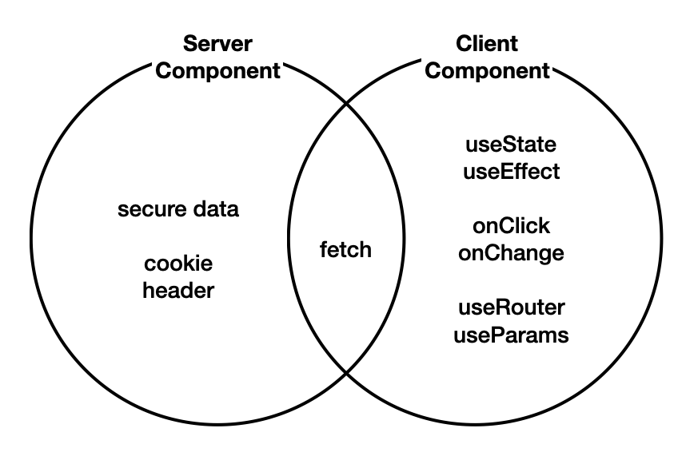

## 서버 컴포넌트 vs 클라이언트 컴포넌트
Nextjs의 컴포넌트는 크게 `server component`와 `client component`로 구분된다<br/>
특별한 처리를 하지 않으면 디폴트 컴포넌트는 `server component` 이다<br/>




#### 서버 컴포넌트
    - 서버에서 렌더링되는 컴포넌트
    - 서버에서 렌더링되기 때문에 빠르게 렌더링되고, SEO에 유리하다
    - 클라이언트 컴포넌트보다 제약이 많다
    - 클라이언트 컴포넌트보다 더 빠르게 렌더링되지만, 덜 유연하다
#### 클라이언트 컴포넌트
    - 클라이언트에서 렌더링되는 컴포넌트
    - 서버 컴포넌트보다 더 유연하지만, 덜 빠르게 렌더링된다

<br/>

### 적절한 사용사례
다음은 서버/클라이언트 컴포넌트의 적절한 사용 사례를 보여준다


#### 서버 컴포넌트
    - 사용자와 상호작용하지 않는 경우(단순 노출)
    - 백엔드에 엑세스하면서 보안적으로 위험한 정보를 주고 받는 경우

#### 클라이언트 컴포넌트
    - 서버 컴포넌트로 해결되지 않는 경우
    - 사용자와 상호작용하는 경우
    - `useEffect`, `useState`, `onClick`, `onChange와` 같이 상태변수나 이펙트 API를 사용해야 하는 경우
    - `useRouter`, `useParams와` 같은 Nextjs의 client component API를 사용하는 경우

<br/>

## SSR(Server Side Rendering)
서버 컴포넌트는 모든 작업을 서버 쪽에서 처리하고, 그 결과인 html 코드만 클라이언트로 전송한다.<br/>
이것을 서버쪽에서 랜더링을 한다고하여 SSR(server side rendering)이라고 한다.

### SSR의 장점
- `간결한 코드`: 클라이언트 컴포넌트 전용 훅을 사용하지 않아 코드가 더 간결하고 이해하기 쉬워짐. 이로 인해 코드 유지 관리가 쉬워지고 버그 발생 확률이 줄어듦.
- `빠른 데이터 엑세스`: 서버 컴포넌트는 데이터베이스와 가까운 위치에서 작동하기때문에 필요한 데이터에 빠르게 접근 가능.
- `보안`: 클라이언트에 민감한 정보(예: 데이터베이스 비밀번호)를 전송하지 않고 안전하게 작업을 처리하면서 클라이언트의 보안 유지.
- `향상된 성능`: 클라이언트로 JavaScript 코드를 전송하지 않는다. 전송되는 데이터의 양을 줄이고, 클라이언트의 부하를 감소시켜 성능을 향상시키는 데 도움이 줌.

### SSR 적용해보기
서버쪽의 글목록 데이터를 가져와서(fetch) 이를 UI에 반영해보자
```jsx
// src/app/layout.js

import Link from 'next/link';
import './globals.css'

export const metadata = {
  title: 'WEB tutorial',
  description: 'Generated by egoing',
}

// 서버에서 데이터를 가져와서 렌더링하는 경우(fetch) `useEffect`를 사용하지 않고 `await`를 사용한다
export default async function RootLayout({ children }) {

  // 글 목록 가져오기
  const resp = await fetch('http://localhost:9999/topics/'); 
  const topics = await resp.json();

  // 출력 결과가 개발자 도구의 콘솔에서는 나타나지 않고, 터미널에서만 출력 된다
  console.log('page/layout.js/topics', topics);

  return (
    <html>
      <body>
        <h1><Link href="/">WEB</Link></h1>
        <ol>
          {topics.map(topic=>{
            return <li key={topic.id}><Link href={`/read/${topic.id}`}>{topic.title}</Link></li>
          })}
        </ol>
        {children}
        <ul>
          <li><Link href="/create">create</Link></li>
          <li><Link href="/update/id">update</Link></li>
          <li><button>delete</button></li>
        </ul>
      </body>
    </html>
  )
}
```

<br/>

## Client Component 구현
`onSubmit`과 같이 사용자와 상호작용하는 코드는 서버 쪽에서 실행할 수 없기 때문에, 클라이언트 쪽으로 전송되어서 실행되야 한다. 클라이언트 컴포넌트를 만드는 방법을 알아보자.

### 클라이언트 컴포넌트로 전환하기
기본적으로 모든 컴포넌트가 서버 컴포넌트라고 가정한다.<br/>
그렇기 때문에 클라이언트 컴포넌트를 사용하려면 지시문을 사용해야 한다.
<!-- 클라이언트 컴포넌트가 되면 `useEffect`, `useState`, `onSubmit`, `useRouter` 과 같은 코드를 사용할 수 있다. -->
```jsx
'use client'
```

### 라우터
#### 라우터 객체 생성
`useRouter`를 사용하면 라우터 객체를 생성할 수 있다<br/>
```jsx
const router = useRouter();
```

#### 사용
`router.push`를 사용하면 페이지 리로드 없이 사용자의 화면을 해당 페이지로 이동한다
```jsx
router.push(`/read/${topic.id}`);
```
`router.refresh`를 사용하면 서버 컴포넌트를 서버 쪽에서 다시 랜더링해서 새로 고침할 수 있다
```jsx
router.refresh();
```

#### cache 업데이트
`router.refresh`를 했음에도 갱신되지 않는다면, 서버쪽에서 fetch를 사용하면 응답 결과를 저장하기 때문이다.<br/>
fetch 단계에서 캐시를 사용하지 않기 위해 `{cache:'no-cache'}` 를 추가한다. 랜더링 될 때매다 캐쉬를 사용하지 않고 신선한 데이터를 가져온다.(매번 MISS)

    MISS: 캐쉬가 없기 때문에 서버에 실제로 접속해서 데이터를 가져왔다는 뜻
    HIT: 캐쉬를 사용했다는 뜻
  
```jsx
const resp = await fetch('http://localhost:9999/topics/', {cache:'no-cache'}); 
```

</br>

## server component에서 client component 사용하기
### 1. server component에서 client component의 기능이 필요한 부분만 별도의 컴포넌트로 분리
```jsx
"use client";
import Link from 'next/link';
import { useParams } from 'next/navigation';

export function Control() {
  const params = useParams(); // only client component
  console.log(params);
  const id = params.id;

  return (
    <ul>
      <li><Link href='/create'>Create</Link></li>
      { id ? (
        <>
          <li><Link href={`/update/${id}`}>Update</Link></li>
          <li><input type='button' value='Delete' /></li>
        </>
      ): null }
    </ul>
  );
}
```

### 2. server component에서 import 하여 사용
```jsx
// ...
import { Control } from './Control';

export default async function RootLayout({ children }) {
  return (
    <html>
      <body>
        // ...
        <Control />
      </body>
    </html>
  )
}
```
